## 句子分析示例 (Sentence Analysis Example)

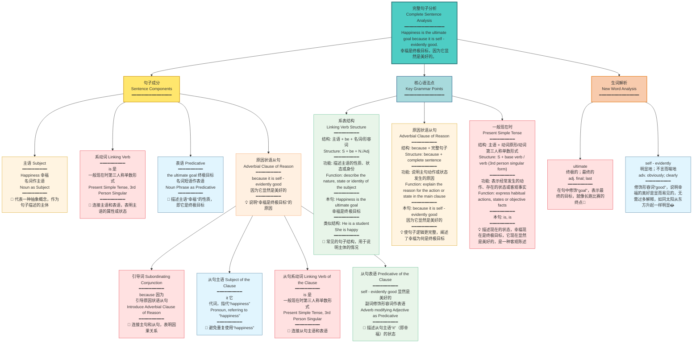

---

# Fall in Love with English

Hiding behind the loose dusty curtain, a teenager packed up his overcoat into the suitcase. He planned to leave home at dusk though there was thunder and lightning outdoors. He had got to do this because he was tired of his parents' nagging about his English study and did not want to go through it any longer. He couldn't get along well with English and disliked joining in English classes because he thought his teacher ignored him on purpose. As a result, his score in each exam never added up to over 60.

His partner was concerned about him very much. She understood exactly what he was suffering from, but entirely disagreed with his idea. In order to calm him down and settle his problem, she talked with him face to face and swapped a series of learning tips with him. The items she set down helped him find the highway to studying English well.

The teenager was grateful and got great power from his friend's words. Now, he has recovered from being upset and has fallen in love with English.

---


# 爱上英语

有个少年躲在积满灰尘的松散窗帘后面，把大衣装进手提箱。尽管外面雷电交加，他还是计划在黄昏时分离家出走。他不得不这样做，因为他厌倦了父母对他英语学习的唠叨，不想再忍受下去了。他无法和英语相处融洽，不喜欢参加英语课，因为他认为老师故意忽视他。结果，他每次考试的分数合计从未超过60分。

他的搭档非常关心他。她确切地理解他所遭受的痛苦，但完全不同意他的想法。为了让他冷静下来并解决他的问题，她和他面对面交谈，和他交换了一系列学习技巧。她写下的这些条目帮助他找到了学好英语的途径。

这个少年很感激，从朋友的话中获得了巨大的力量。现在，他已经从沮丧中恢复过来，并且爱上了英语。

---

## 重点词汇与短语 (Key Vocabulary & Phrases)

| 英文 | 中文 | 词性 |
|------|------|------|
| hide behind | 躲在...后面 | 短语 |
| loose | 松散的 | 形容词 |
| dusty | 积满灰尘的 | 形容词 |
| curtain | 窗帘 | 名词 |
| pack up | 打包 | 短语动词 |
| overcoat | 大衣 | 名词 |
| suitcase | 手提箱 | 名词 |
| at dusk | 在黄昏时分 | 短语 |
| thunder | 雷声 | 名词 |
| lightning | 闪电 | 名词 |
| outdoors | 在户外 | 副词 |
| be tired of | 厌倦 | 短语 |
| nagging | 唠叨 | 名词/动词 |
| go through | 经历，忍受 | 短语动词 |
| get along well with | 与...相处融洽 | 短语 |
| join in | 参加 | 短语动词 |
| on purpose | 故意地 | 短语 |
| as a result | 结果 | 短语 |
| add up to | 合计达到 | 短语 |
| be concerned about | 关心 | 短语 |
| exactly | 确切地 | 副词 |
| suffer from | 遭受 | 短语 |
| entirely | 完全地 | 副词 |
| disagree with | 不同意 | 短语 |
| calm down | 冷静下来 | 短语动词 |
| settle | 解决 | 动词 |
| face to face | 面对面 | 短语 |
| swap | 交换 | 动词 |
| a series of | 一系列 | 短语 |
| tip | 技巧，窍门 | 名词 |
| set down | 写下，记下 | 短语动词 |
| highway | 公路，途径 | 名词 |
| grateful | 感激的 | 形容词 |
| power | 力量 | 名词 |
| recover from | 从...中恢复 | 短语 |
| upset | 沮丧的 | 形容词 |
| fall in love with | 爱上 | 短语 |

---

## 语法要点 (Grammar Points)

### 1. 过去完成时 (Past Perfect Tense)
- **He had got to do this** - 表示过去某个时间之前已经完成的动作

### 2. 原因状语从句 (Adverbial Clause of Reason)
- **because he was tired of...** - 使用because引导原因

### 3. 宾语从句 (Object Clause)
- **he thought his teacher ignored him** - thought后接宾语从句

### 4. 现在完成时 (Present Perfect Tense)
- **he has recovered from...** - 表示过去的动作对现在的影响
- **has fallen in love with** - 强调状态的持续

---

## 学习建议 (Study Tips)

1. **词汇积累**：重点记忆文中的短语搭配，如"be tired of"、"get along with"等
2. **情境记忆**：通过故事情节理解词汇的实际应用场景
3. **朗读练习**：大声朗读全文，培养语感
4. **复述训练**：尝试用自己的话复述故事内容
5. **写作应用**：模仿文章结构，写一篇类似主题的短文


## 简单句


## be动词（is are）

* is

  > 第三人称单数：	He/She/It is here.
  >
  > 不可数名词：	Water is important.
  >
  > 集体名词强调整体：	The team is strong.
  >
  > 存在句单数：	There is a pen on the desk.

* are

  > I/You/We/They are friends.	You and I are good partners.
  >
  > 复数名词：The books are on the table.
  >
  > 集体名词强调成员：	The team are arguing.
  >
  > 存在句复数：	There are three pens on the desk.

## be动词的过去式（was were）

* was

  > 第一人单数:	I was tired yesterday.
  >
  > 第三人称（he,she,it,单数名称）单数:	The cate was hungry.

* were

  > you 无论单双固定搭配were:	You were late.
  >
  > 虚拟语气，在表示假设、愿望或与事实相反的情况中无论主语是什么人称都were
  >
  > if 引导的非真实条件句：If I were you，I would study harder.
  >
  > wish表达愿望：I wish she were here.

  

## 时态

### 一般过去时

> 定义：
>
> 1. 过去某时刻发生的动作或所处的状态
> 2. 过去常常发生的动作
>
> 结构：
>
> 1. 主语 + was\were
> 2. 主语 + V过去式
>
> 标志词：昨天上个XX前，in+过去年份别忘记
>
> ​	yesterday	the day before yesterday
>
> ​	last week	last year	last month
>
> ​	five days ago	two minutes ago
>
> ​	in 1998

- +ed

  > looked	
  >
  > // live	lived 不发音的e结尾要去e+d			

- 辅元辅结构并且音调重读：双写+ed

  > plan	 planned	stop	stopped
  >
  > // open	opened  没有音调重读

- 辅+y结尾：y变i + ed

  > study	 studied
  >
  > // stay	stayed  没有满足辅音结构

- 特殊变化

  > go	went
  >
  > get	got
  >
  > say	 said
  >
  > come	came

#### 句型转换

> I was a student ten years ago.
>
> 否定句-be动词+not:	I wasn't a student ten years age.
>
> 一般疑问句-be动词提前: 	Were you a student ten years ago?
>
> I went to the theatre last week.
>
> 否定句-助动词后面+照妖镜原型:	I didn't go to the theatre last week.
>
> 一般疑问句-助动词提前:	Did you go to the theatre last week?

### 一般现在时

> v原型do/第三人称单数does
>
> The earth moves around the sun.
>
> Peter doesn't play tennis at weekends.每个周末都不打网球（经常性的）

### 一般将来时

> will + v原型 （临时决定）
>
> am/is/are going to + v原型 （有计划的决定）
>
> 

### 过去将来时

> would + v原型
>
> was/were going to + v原型
>
> Tony finished his work，and then he would leave for London.
>
> Lily told her teacher she would hand in the homework the next day.

### 过去/现在/将来进行时

> be + doing 
>
> I was watching TV when you called me.

### 现在完成时

> have/has +done 过去分词
>
> 表示从现在往过去看的结果
>
> He has finished his homework.
>
> 他过去完成了他的作业。
>
> We have learned English since 1998.
>
> We have lived here since 1992.

### 现在完成进行时 (Present Perfect Continuous Tense)

> **定义：**
>
> 表示从过去某个时间开始，一直持续到现在，并且可能继续下去的动作。强调动作的持续性和未完成性。
>
> **结构：**
>
> have/has + been + doing (现在分词)
>
> - 主语 (I/You/We/They) + have been + doing
> - 主语 (He/She/It) + has been + doing
>
> **标志词：**
>
> - since + 过去时间点 (since 1998, since last week, since 8 o'clock)
> - for + 时间段 (for two hours, for three days, for a long time)
> - all day/week/month/year (整天/整周/整月/整年)
> - recently (最近)
> - lately (近来)
> - How long...? (多久了？)

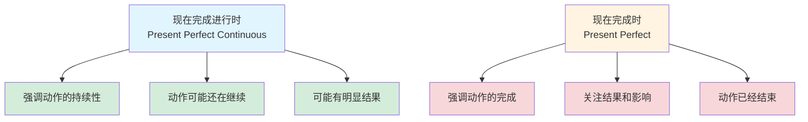

| 时态 | 例句 | 中文 | 强调点 |
|------|------|------|--------|
| 现在完成进行时 | I **have been studying** English for 3 hours. | 我已经学了3小时英语了。 | 强调持续学习的过程，可能还在继续 |
| 现在完成时 | I **have studied** English for 3 years. | 我已经学了3年英语了。 | 强调学习的经历和结果 |
| 现在完成进行时 | She **has been waiting** for you since 8 o'clock. | 她从8点就一直在等你。 | 强调等待的持续性 |
| 现在完成时 | She **has waited** for 2 hours. | 她已经等了2小时。 | 强调等待的时长 |

- **现在完成进行时**：他从早上8点开始跑，现在10点了，他还在跑步机上，满头大汗。强调的是"一直在跑"这个持续的过程。
  - He **has been running** for 2 hours. (他已经跑了2小时了)
  
- **现在完成时**：他跑完了，现在已经下来了，但你能看到他的汗水和疲惫。强调的是"跑完了"这个结果。
  - He **has run** 10 kilometers. (他已经跑了10公里)

### 过去完成时 (Past Perfect Tense)

> **定义：**
>
> 表示在过去某个时间或动作之前已经完成的动作或状态。强调"过去的过去"。
>
> **结构：**
>
> had + done (过去分词)
>
> - 主语 + had + done (所有人称都用 had)
>
> **标志词：**
>
> - by + 过去时间 (by the end of last year, by then, by that time)
> - before + 过去时间 (before 2010, before he came)
> - when/after/until + 一般过去时
> - already, yet, just, never, ever (用于过去完成时)

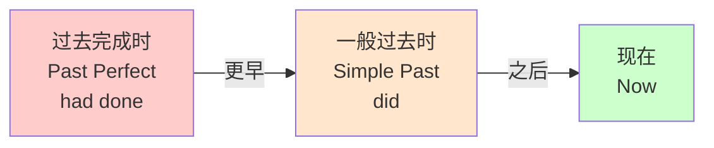

| 时态 | 例句 | 中文 | 时间点 |
|------|------|------|--------|
| 过去完成时 | I **had finished** my homework when he came. | 当他来的时候，我已经完成作业了。 | 完成作业（更早）→ 他来了（过去） |
| 一般过去时 | I **finished** my homework yesterday. | 我昨天完成了作业。 | 完成作业（过去）→ 现在 |
| 过去完成时 | She **had left** before I arrived. | 在我到达之前她已经离开了。 | 她离开（更早）→ 我到达（过去） |
| 一般过去时 | She **left** at 8 o'clock. | 她8点离开了。 | 离开（过去）→ 现在 |

## 被动语态（be  + done）

* The environment here is being changed.正在被改变

* The environment here had been changed.过去已经被改变

* The environment here can be changed.结合情态动词（+V原型）这里的环境是可以改变的

* The project **has been running** for three months so far.

  so far(到目前为止) + for(持续时间段)

## 情态动词 (Modal Verbs)

### 1. Can / Could - 能力与许可 (Ability & Permission)

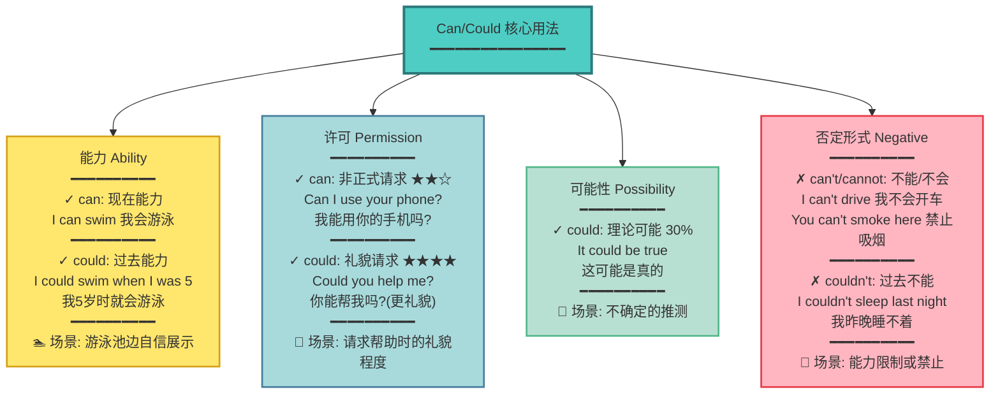

---

### 2. May / Might - 可能性与许可 (Possibility & Permission)

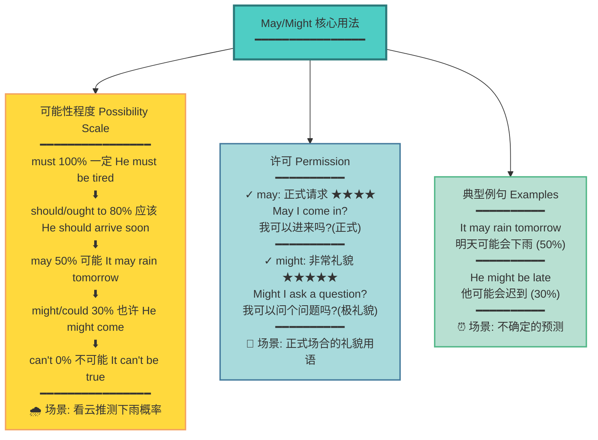

---

### 3. Must / Have to - 必须与义务 (Obligation & Necessity)

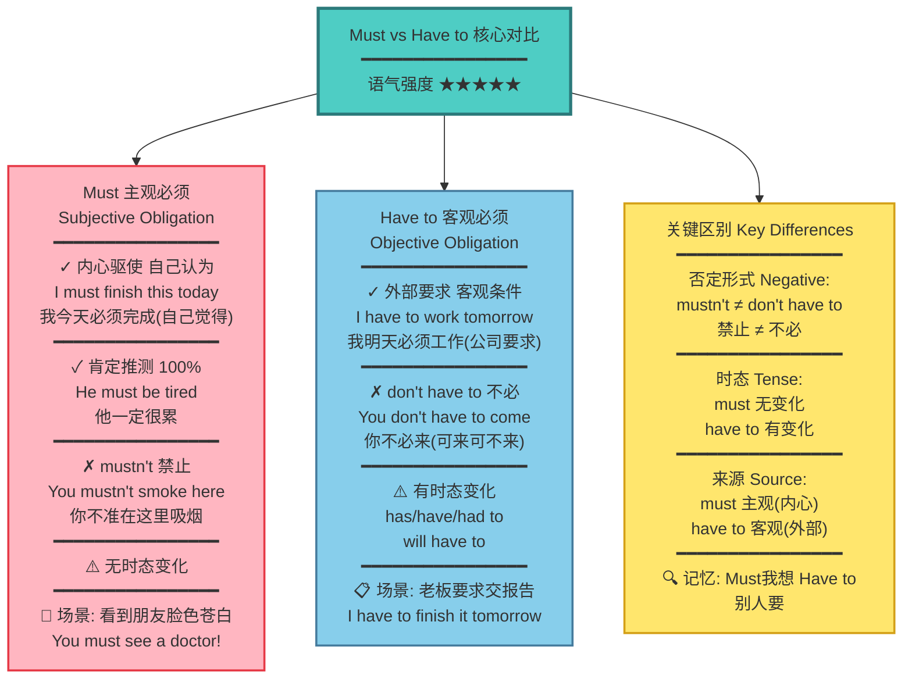

---

### 4. Should / Ought to - 应该与建议 (Advice & Suggestion)

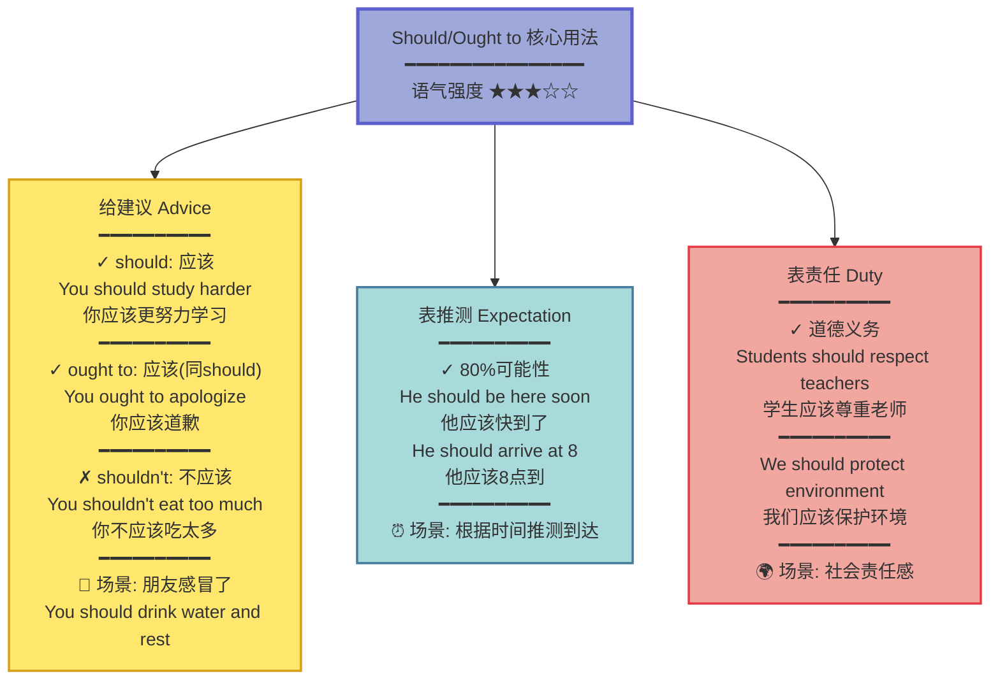

---

### 5. Will / Would - 意愿与习惯 (Willingness & Habit)

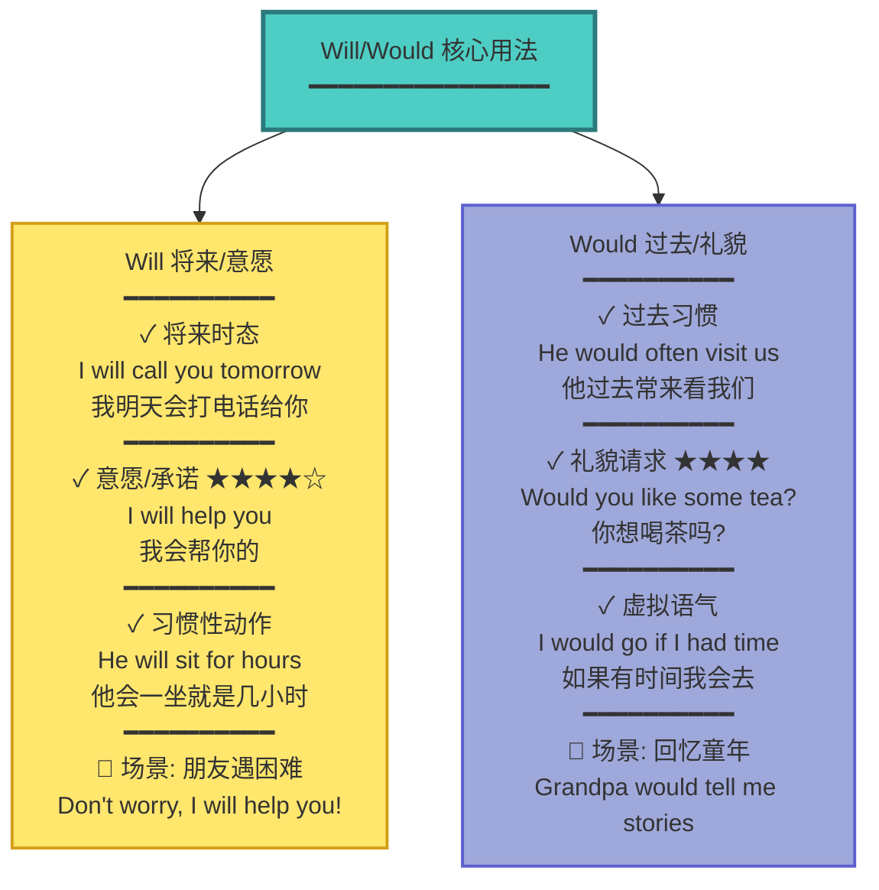

---

### 6. Had better / Need / Dare - 其他情态动词 (Other Modals)

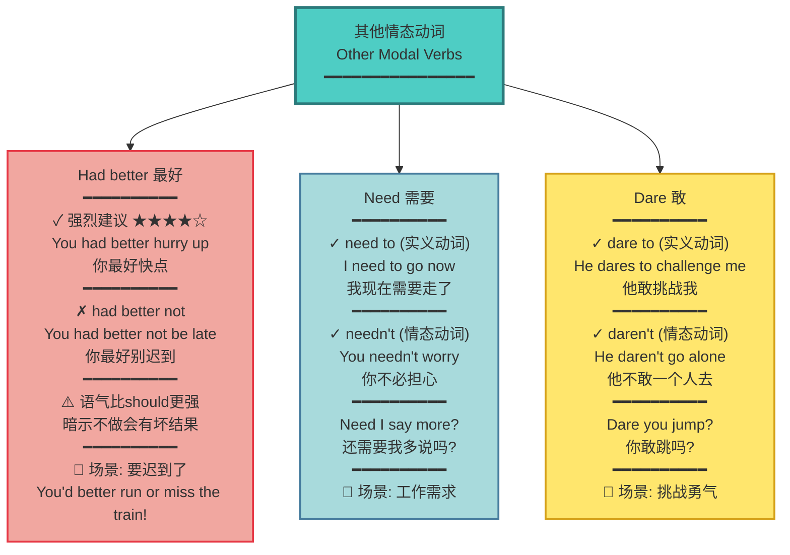

---

### 7. 情态动词 + have done - 对过去的推测 (Past Speculation)

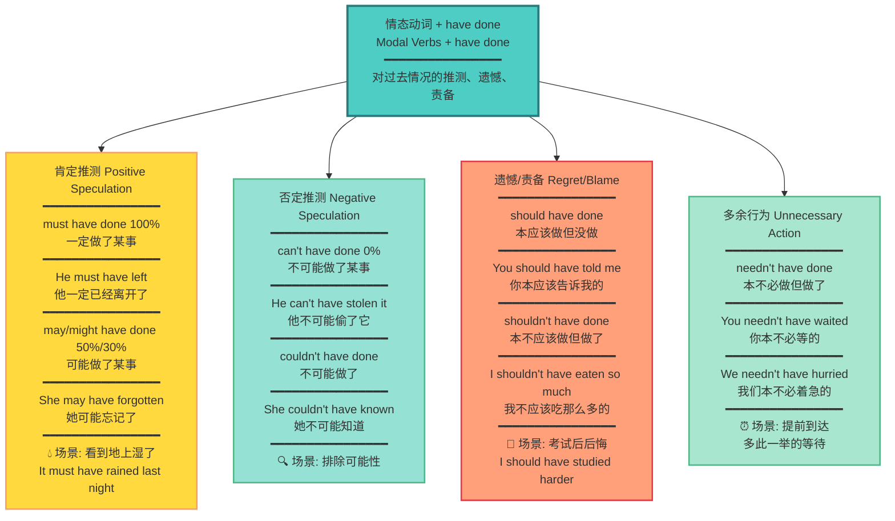

---

### 8. 情态动词总结对比 (Modal Verbs Comparison)

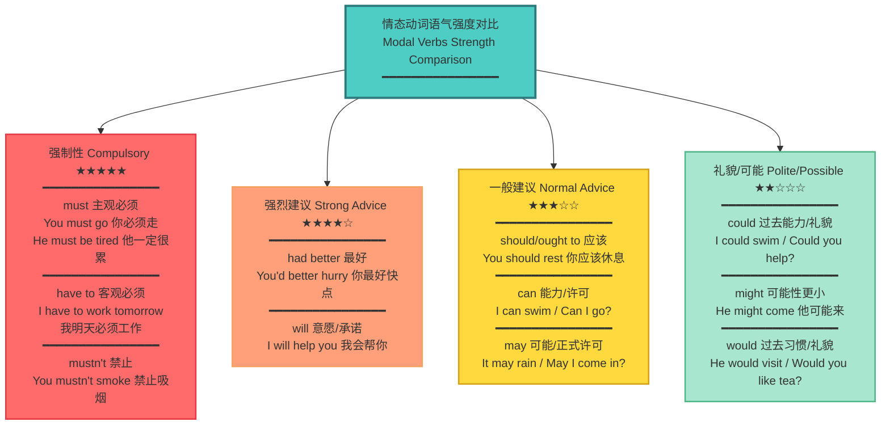

## 形容词和副词 (Adjectives & Adverbs)

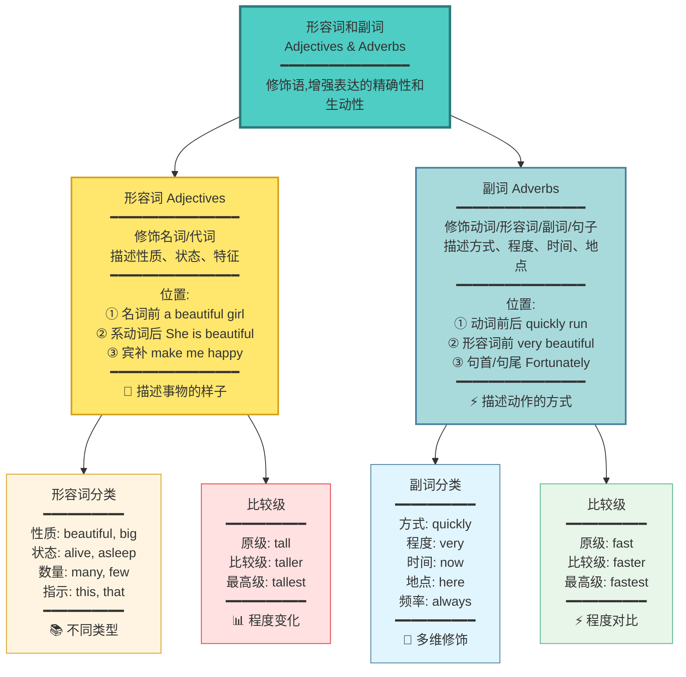

---


## 介词短语 (Prepositional Phrases)

```mermaid
graph LR
    A["介词短语完整知识体系<br/>Prepositional Phrases System<br/>━━━━━━━━━━━━━━━━<br/>介词 + 名词/代词/动名词"] --> B["时间介词 Time<br/>━━━━━━━━━━━━━━━━"]
    
    A --> C["地点介词 Place<br/>━━━━━━━━━━━━━━━━"]
    
    A --> D["方式介词 Manner<br/>━━━━━━━━━━━━━━━━"]
    
    A --> E["句法功能 Functions<br/>━━━━━━━━━━━━━━━━"]
    
    A --> F["固定搭配 Fixed Phrases<br/>━━━━━━━━━━━━━━━━"]
    
    A --> G["易混淆 Confusing<br/>━━━━━━━━━━━━━━━━"]
    
    A --> H["其他常用介词<br/>Other Prepositions<br/>━━━━━━━━━━━━━━━━"]
    
    B --> B1["at 具体时刻<br/>━━━━━━━━━━<br/>at 8 o'clock 8点<br/>at noon 中午<br/>at night 晚上<br/>at midnight 午夜<br/>━━━━━━━━━━<br/>⏰ 精确时刻"]
    
    B --> B2["on 具体日期<br/>━━━━━━━━━━<br/>on Monday 周一<br/>on May 1st 5月1日<br/>on New Year's Day 元旦<br/>on Monday morning 周一早上<br/>━━━━━━━━━━<br/>📅 具体某天"]
    
    B --> B3["in 时间段<br/>━━━━━━━━━━<br/>in 2024 2024年<br/>in May 5月<br/>in spring 春天<br/>in the morning 早上<br/>in the 21st century 21世纪<br/>━━━━━━━━━━<br/>📆 较长时段"]
    
    C --> C1["at 小地点<br/>━━━━━━━━━━<br/>at home 在家<br/>at school 在学校<br/>at the station 在车站<br/>at the door 在门口<br/>━━━━━━━━━━<br/>🎯 具体点"]
    
    C --> C2["in 大地点/内部<br/>━━━━━━━━━━<br/>in China 在中国<br/>in Beijing 在北京<br/>in the room 在房间里<br/>in the box 在盒子里<br/>━━━━━━━━━━<br/>📦 内部空间"]
    
    C --> C3["on 表面<br/>━━━━━━━━━━<br/>on the table 在桌上<br/>on the wall 在墙上<br/>on the floor 在地板上<br/>on the street 在街上<br/>━━━━━━━━━━<br/>📄 表面接触"]
    
    D --> D1["by 方式<br/>━━━━━━━━━━<br/>by bus 乘公交<br/>by email 通过邮件<br/>by hand 手工<br/>━━━━━━━━━━<br/>🚌 交通方式"]
    
    D --> D2["with 工具/伴随<br/>━━━━━━━━━━<br/>with a pen 用笔<br/>with friends 和朋友<br/>with care 小心地<br/>━━━━━━━━━━<br/>✏️ 工具伴随"]
    
    D --> D3["in 语言/方式<br/>━━━━━━━━━━<br/>in English 用英语<br/>in this way 用这种方式<br/>in a loud voice 大声地<br/>━━━━━━━━━━<br/>🗣️ 语言方式"]
    
    E --> E1["作定语<br/>━━━━━━━━━━<br/>The book on the desk<br/>桌上的书<br/>The girl in red<br/>穿红衣服的女孩<br/>━━━━━━━━━━<br/>📖 修饰名词"]
    
    E --> E2["作状语<br/>━━━━━━━━━━<br/>arrived at 8 o'clock 时间<br/>lives in Beijing 地点<br/>went by bus 方式<br/>━━━━━━━━━━<br/>⚡ 修饰动词"]
    
    E --> E3["作表语<br/>━━━━━━━━━━<br/>He is at home<br/>他在家<br/>The meeting is at 3 pm<br/>会议在3点<br/>━━━━━━━━━━<br/>🎯 说明主语"]
    
    E --> E4["作宾补<br/>━━━━━━━━━━<br/>found him in the room<br/>发现他在房间里<br/>keep it out of reach<br/>放在够不到的地方<br/>━━━━━━━━━━<br/>💫 补充宾语"]
    
    F --> F1["be + adj + prep<br/>━━━━━━━━━━<br/>be good at 擅长<br/>be interested in 感兴趣<br/>be afraid of 害怕<br/>be proud of 自豪<br/>be famous for 著名<br/>━━━━━━━━━━<br/>🎨 形容词搭配"]
    
    F --> F2["verb + prep<br/>━━━━━━━━━━<br/>look at 看<br/>look for 寻找<br/>look after 照顾<br/>listen to 听<br/>wait for 等待<br/>━━━━━━━━━━<br/>⚡ 动词搭配"]
    
    F --> F3["介词 + doing<br/>━━━━━━━━━━<br/>be good at doing<br/>look forward to doing<br/>thank you for doing<br/>━━━━━━━━━━<br/>注意: to是介词!<br/>后接动名词-ing<br/>━━━━━━━━━━<br/>🔄 动词名词化"]
    
    F --> F4["固定表达<br/>━━━━━━━━━━<br/>in fact 事实上<br/>on time 准时<br/>in time 及时<br/>at least 至少<br/>by the way 顺便说<br/>for example 例如<br/>━━━━━━━━━━<br/>💡 常用短语"]
    
    G --> G1["in time vs on time<br/>━━━━━━━━━━<br/>in time 及时<br/>arrived in time for meeting<br/>━━━━━━━━━━<br/>on time 准时<br/>arrived on time<br/>━━━━━━━━━━<br/>⏰ 时间辨析"]
    
    G --> G2["in/on the tree<br/>━━━━━━━━━━<br/>in the tree 外来物<br/>The bird is in the tree<br/>━━━━━━━━━━<br/>on the tree 长在上面<br/>The apple is on the tree<br/>━━━━━━━━━━<br/>🌳 位置辨析"]
    
    G --> G3["at the end vs in the end<br/>━━━━━━━━━━<br/>at the end of 在...末尾<br/>at the end of the street<br/>━━━━━━━━━━<br/>in the end 最后,终于<br/>In the end, he succeeded<br/>━━━━━━━━━━<br/>🎯 含义辨析"]
    
    H --> H1["of 所属/关于<br/>━━━━━━━━━━<br/>所属关系:<br/>the door of the room 房间的门<br/>a friend of mine 我的一个朋友<br/>━━━━━━━━━━<br/>关于/涉及:<br/>the city of Beijing 北京市<br/>the problem of pollution 污染问题<br/>━━━━━━━━━━<br/>材料/内容:<br/>a cup of tea 一杯茶<br/>a piece of paper 一张纸<br/>━━━━━━━━━━<br/>📋 从属关系"]
    
    H --> H2["for 目的/原因<br/>━━━━━━━━━━<br/>目的:<br/>study for the exam 为考试学习<br/>leave for Beijing 动身去北京<br/>━━━━━━━━━━<br/>原因:<br/>famous for 因...而著名<br/>thank you for 感谢你...<br/>━━━━━━━━━━<br/>对象/给予:<br/>a gift for you 给你的礼物<br/>work for a company 为公司工作<br/>━━━━━━━━━━<br/>时间段:<br/>for 3 hours 持续3小时<br/>for a long time 很长时间<br/>━━━━━━━━━━<br/>🎯 目的原因"]
    
    H --> H3["to 方向/对象<br/>━━━━━━━━━━<br/>方向:<br/>go to school 去学校<br/>from...to 从...到...<br/>━━━━━━━━━━<br/>对象/给予:<br/>give it to me 给我<br/>talk to him 和他说话<br/>━━━━━━━━━━<br/>比较:<br/>prefer A to B 比起B更喜欢A<br/>━━━━━━━━━━<br/>附属:<br/>the key to the door 门的钥匙<br/>the answer to the question 问题的答案<br/>━━━━━━━━━━<br/>➡️ 方向指向"]
    
    H --> H4["from 来源/起点<br/>━━━━━━━━━━<br/>来源:<br/>a letter from Tom 来自Tom的信<br/>learn from mistakes 从错误中学习<br/>━━━━━━━━━━<br/>起点:<br/>from Monday to Friday 从周一到周五<br/>from 9 to 5 从9点到5点<br/>━━━━━━━━━━<br/>区别:<br/>different from 与...不同<br/>far from 远离<br/>━━━━━━━━━━<br/>材料:<br/>made from 由...制成(看不出原料)<br/>━━━━━━━━━━<br/>⬅️ 起源来源"]
    
    H --> H5["about/around 关于<br/>━━━━━━━━━━<br/>about 关于:<br/>talk about 谈论<br/>a book about history 关于历史的书<br/>What about...? ...怎么样?<br/>━━━━━━━━━━<br/>about 大约:<br/>about 10 people 大约10人<br/>at about 3 pm 大约下午3点<br/>━━━━━━━━━━<br/>around 周围:<br/>around the world 世界各地<br/>look around 四处看看<br/>━━━━━━━━━━<br/>around 大约:<br/>around 100 dollars 大约100美元<br/>━━━━━━━━━━<br/>💬 关于周围"]
    
    H --> H6["through/across 穿过<br/>━━━━━━━━━━<br/>through 穿过(内部):<br/>walk through the forest 穿过森林<br/>go through the tunnel 穿过隧道<br/>━━━━━━━━━━<br/>through 通过/凭借:<br/>through hard work 通过努力<br/>learn through practice 通过实践学习<br/>━━━━━━━━━━<br/>across 横穿(表面):<br/>walk across the street 穿过街道<br/>swim across the river 游过河<br/>━━━━━━━━━━<br/>across 遍及:<br/>across the country 全国各地<br/>━━━━━━━━━━<br/>🚶 穿越通过"]
    
    H --> H7["between/among 之间<br/>━━━━━━━━━━<br/>between 两者之间:<br/>between A and B 在A和B之间<br/>between 9 and 10 在9点到10点之间<br/>the difference between 两者的区别<br/>━━━━━━━━━━<br/>among 三者及以上:<br/>among the students 在学生们中间<br/>popular among young people<br/>在年轻人中很受欢迎<br/>━━━━━━━━━━<br/>👥 之间关系"]
    
    H --> H8["without/except 除了<br/>━━━━━━━━━━<br/>without 没有:<br/>without water 没有水<br/>without doubt 毫无疑问<br/>can't live without 离不开<br/>━━━━━━━━━━<br/>except 除了(排除):<br/>everyone except me 除了我之外的所有人<br/>except for 除了...之外<br/>━━━━━━━━━━<br/>besides 除了(包括):<br/>besides English 除了英语(还有其他)<br/>━━━━━━━━━━<br/>🚫 排除包含"]
    
    style A fill:#4ECDC4,stroke:#2C7A7B,stroke-width:3px
    style B fill:#FFE66D,stroke:#D4A017,stroke-width:2px
    style C fill:#A8DADC,stroke:#457B9D,stroke-width:2px
    style D fill:#B8E0D2,stroke:#52B788,stroke-width:2px
    style E fill:#FFA07A,stroke:#F4A261,stroke-width:2px
    style F fill:#D4A5A5,stroke:#BC6C25,stroke-width:2px
    style G fill:#9FA8DA,stroke:#5E60CE,stroke-width:2px
    style H fill:#FFB6C1,stroke:#E75480,stroke-width:2px
    
    style B1 fill:#FFF4E1,stroke:#D4A017,stroke-width:1px
    style B2 fill:#FFF4E1,stroke:#D4A017,stroke-width:1px
    style B3 fill:#FFF4E1,stroke:#D4A017,stroke-width:1px
    style C1 fill:#E1F5FE,stroke:#457B9D,stroke-width:1px
    style C2 fill:#E1F5FE,stroke:#457B9D,stroke-width:1px
    style C3 fill:#E1F5FE,stroke:#457B9D,stroke-width:1px
    style D1 fill:#E8F5E9,stroke:#52B788,stroke-width:1px
    style D2 fill:#E8F5E9,stroke:#52B788,stroke-width:1px
    style D3 fill:#E8F5E9,stroke:#52B788,stroke-width:1px
    style E1 fill:#FFE1E1,stroke:#E63946,stroke-width:1px
    style E2 fill:#FFE1E1,stroke:#E63946,stroke-width:1px
    style E3 fill:#FFE1E1,stroke:#E63946,stroke-width:1px
    style E4 fill:#FFE1E1,stroke:#E63946,stroke-width:1px
    style F1 fill:#F5E6D3,stroke:#BC6C25,stroke-width:1px
    style F2 fill:#F5E6D3,stroke:#BC6C25,stroke-width:1px
    style F3 fill:#F5E6D3,stroke:#BC6C25,stroke-width:1px
    style F4 fill:#F5E6D3,stroke:#BC6C25,stroke-width:1px
    style G1 fill:#E8E4F3,stroke:#5E60CE,stroke-width:1px
    style G2 fill:#E8E4F3,stroke:#5E60CE,stroke-width:1px
    style G3 fill:#E8E4F3,stroke:#5E60CE,stroke-width:1px
    style H1 fill:#FFE4E9,stroke:#E75480,stroke-width:1px
    style H2 fill:#FFE4E9,stroke:#E75480,stroke-width:1px
    style H3 fill:#FFE4E9,stroke:#E75480,stroke-width:1px
    style H4 fill:#FFE4E9,stroke:#E75480,stroke-width:1px
    style H5 fill:#FFE4E9,stroke:#E75480,stroke-width:1px
    style H6 fill:#FFE4E9,stroke:#E75480,stroke-width:1px
    style H7 fill:#FFE4E9,stroke:#E75480,stroke-width:1px
    style H8 fill:#FFE4E9,stroke:#E75480,stroke-width:1px
```

---

## 非谓语动词 (Non-finite Verbs)

```mermaid
graph TB
    A["非谓语动词<br/>Non-finite Verbs<br/>━━━━━━━━━━━━━━━━<br/>不能单独作谓语的动词形式<br/>包括:不定式、动名词、分词"] --> B["不定式 Infinitive<br/>━━━━━━━━━━━━━━━━<br/>to + 动词原形"]
    
    A --> C["动名词 Gerund<br/>━━━━━━━━━━━━━━━━<br/>动词-ing形式<br/>具有名词性质"]
    
    A --> D["分词 Participle<br/>━━━━━━━━━━━━━━━━<br/>现在分词 -ing<br/>过去分词 -ed/不规则"]
    
    B --> B1["不定式的形式<br/>━━━━━━━━━━<br/>一般式: to do<br/>I want to go<br/>━━━━━━━━━━<br/>进行式: to be doing<br/>He seems to be sleeping<br/>━━━━━━━━━━<br/>完成式: to have done<br/>He seems to have left<br/>━━━━━━━━━━<br/>被动式: to be done<br/>The work needs to be finished<br/>━━━━━━━━━━<br/>📝 四种形式"]
    
    B --> B2["不定式的用法<br/>━━━━━━━━━━<br/>作主语:<br/>To learn English is important<br/>━━━━━━━━━━<br/>作宾语:<br/>I want to go home<br/>━━━━━━━━━━<br/>作表语:<br/>My job is to teach English<br/>━━━━━━━━━━<br/>作定语:<br/>I have something to do<br/>━━━━━━━━━━<br/>作状语:<br/>I came here to see you(目的)<br/>━━━━━━━━━━<br/>作宾补:<br/>I ask him to help me<br/>━━━━━━━━━━<br/>🎯 六大功能"]
    
    B --> B3["不定式的省略<br/>━━━━━━━━━━<br/>感官动词后省to:<br/>see/watch/hear/feel sb do<br/>I saw him leave<br/>━━━━━━━━━━<br/>使役动词后省to:<br/>make/let/have sb do<br/>Let me help you<br/>━━━━━━━━━━<br/>help后可省to:<br/>help sb (to) do<br/>━━━━━━━━━━<br/>并列不定式省to:<br/>I want to sing and dance<br/>━━━━━━━━━━<br/>✂️ 省略规则"]
    
    C --> C1["动名词的形式<br/>━━━━━━━━━━<br/>一般式: doing<br/>I enjoy reading<br/>━━━━━━━━━━<br/>完成式: having done<br/>He regrets having said that<br/>━━━━━━━━━━<br/>被动式: being done<br/>He dislikes being praised<br/>━━━━━━━━━━<br/>完成被动: having been done<br/>━━━━━━━━━━<br/>📝 四种形式"]
    
    C --> C2["动名词的用法<br/>━━━━━━━━━━<br/>作主语:<br/>Swimming is good exercise<br/>━━━━━━━━━━<br/>作宾语:<br/>I enjoy reading books(动宾)<br/>We can practice English by speaking it more often.(介宾只能用动名词形式)<br/>━━━━━━━━━━<br/>作表语:<br/>My hobby is collecting stamps<br/>My hobby is to collect stamps<br/>━━━━━━━━━━<br/>作定语:<br/>a swimming pool 游泳池<br/>a reading room 阅览室<br/>━━━━━━━━━━<br/>🎯 四大功能"]
    
    C --> C3["动名词 vs 不定式<br/>━━━━━━━━━━<br/>只接动名词的动词:<br/>enjoy, finish, mind, avoid<br/>suggest, practice, keep<br/>━━━━━━━━━━<br/>只接不定式的动词:<br/>want, hope, decide, plan<br/>agree, refuse, promise<br/>━━━━━━━━━━<br/>两者都可的动词:<br/>like, love, hate, start<br/>begin, continue<br/>━━━━━━━━━━<br/>意义不同的动词:<br/>remember to do 记得去做<br/>remember doing 记得做过<br/>━━━━━━━━━━<br/>⚖️ 用法对比"]
    
    D --> D1["现在分词 -ing<br/>━━━━━━━━━━<br/>表示主动/进行<br/>━━━━━━━━━━<br/>作定语:<br/>a sleeping baby 正在睡觉的婴儿<br/>a running man 正在跑步的人<br/>━━━━━━━━━━<br/>作表语:<br/>The story is interesting<br/>故事很有趣<br/>━━━━━━━━━━<br/>作宾补:<br/>I saw him crossing the street<br/>我看见他正在过马路<br/>━━━━━━━━━━<br/>作状语:<br/>Walking in the park, I met Tom<br/>在公园散步时,我遇见了Tom<br/>━━━━━━━━━━<br/>⚡ 主动进行"]
    
    D --> D2["过去分词 -ed<br/>━━━━━━━━━━<br/>表示被动/完成<br/>━━━━━━━━━━<br/>作定语:<br/>a broken window 破碎的窗户<br/>spoken English 英语口语<br/>━━━━━━━━━━<br/>作表语:<br/>I am interested in music<br/>我对音乐感兴趣<br/>━━━━━━━━━━<br/>作宾补:<br/>I heard my name called<br/>我听到有人叫我的名字<br/>━━━━━━━━━━<br/>作状语:<br/>Given more time, I can do better<br/>如果给更多时间,我能做得更好<br/>━━━━━━━━━━<br/>🔒 被动完成"]
    
    D --> D3["分词的区别<br/>━━━━━━━━━━<br/>-ing vs -ed 作定语:<br/>a developing country 发展中国家<br/>a developed country 发达国家<br/>━━━━━━━━━━<br/>-ing vs -ed 作表语:<br/>The book is interesting 书有趣<br/>I am interested 我感兴趣<br/>━━━━━━━━━━<br/>规律:<br/>-ing 令人...(主动)<br/>-ed 感到...(被动)<br/>━━━━━━━━━━<br/>常见词对:<br/>interesting/interested<br/>exciting/excited<br/>surprising/surprised<br/>boring/bored<br/>━━━━━━━━━━<br/>🔄 主被动对比"]
    
    style A fill:#4ECDC4,stroke:#2C7A7B,stroke-width:3px
    style B fill:#FFE66D,stroke:#D4A017,stroke-width:2px
    style C fill:#A8DADC,stroke:#457B9D,stroke-width:2px
    style D fill:#B8E0D2,stroke:#52B788,stroke-width:2px
    
    style B1 fill:#FFF4E1,stroke:#D4A017,stroke-width:1px
    style B2 fill:#FFF4E1,stroke:#D4A017,stroke-width:1px
    style B3 fill:#FFF4E1,stroke:#D4A017,stroke-width:1px
    style C1 fill:#E1F5FE,stroke:#457B9D,stroke-width:1px
    style C2 fill:#E1F5FE,stroke:#457B9D,stroke-width:1px
    style C3 fill:#E1F5FE,stroke:#457B9D,stroke-width:1px
    style D1 fill:#E8F5E9,stroke:#52B788,stroke-width:1px
    style D2 fill:#E8F5E9,stroke:#52B788,stroke-width:1px
    style D3 fill:#E8F5E9,stroke:#52B788,stroke-width:1px
```

---

### 句子分析示例:动名词与不定式作主语

#### 1. Swimming is good exercise.
#### 2. To swim is good exercise.
#### 3. It is good exercise to swim.

```mermaid
graph TB
    A["三个句子对比分析<br/>Comparison of Three Sentences<br/>━━━━━━━━━━━━━━━━<br/>都表达:游泳是很好的锻炼"] --> B["句子1: Swimming is good exercise<br/>━━━━━━━━━━━━━━━━"]
    
    A --> C["句子2: To swim is good exercise<br/>━━━━━━━━━━━━━━━━"]
    
    A --> D["句子3: It is good exercise to swim<br/>━━━━━━━━━━━━━━━━"]
    
    B --> B1["句子结构<br/>━━━━━━━━━━<br/>主语: Swimming<br/>动名词作主语<br/>━━━━━━━━━━<br/>系动词: is<br/>━━━━━━━━━━<br/>表语: good exercise<br/>名词短语<br/>━━━━━━━━━━<br/>🏊 动名词主语"]
    
    B --> B2["语法特点<br/>━━━━━━━━━━<br/>动名词作主语:<br/>强调一般性、习惯性动作<br/>━━━━━━━━━━<br/>更口语化、自然<br/>最常用的表达方式<br/>━━━━━━━━━━<br/>类似例句:<br/>Reading is important<br/>Smoking is harmful<br/>Learning English takes time<br/>━━━━━━━━━━<br/>💡 习惯表达"]
    
    C --> C1["句子结构<br/>━━━━━━━━━━<br/>主语: To swim<br/>不定式作主语<br/>━━━━━━━━━━<br/>系动词: is<br/>━━━━━━━━━━<br/>表语: good exercise<br/>名词短语<br/>━━━━━━━━━━<br/>🎯 不定式主语"]
    
    C --> C2["语法特点<br/>━━━━━━━━━━<br/>不定式作主语:<br/>强调具体的、一次性动作<br/>━━━━━━━━━━<br/>较正式、书面化<br/>现代英语中较少用<br/>━━━━━━━━━━<br/>类似例句:<br/>To learn is never too late<br/>To see is to believe<br/>━━━━━━━━━━<br/>📚 正式表达"]
    
    D --> D1["句子结构<br/>━━━━━━━━━━<br/>形式主语: It<br/>代替真正主语<br/>━━━━━━━━━━<br/>系动词: is<br/>━━━━━━━━━━<br/>表语: good exercise<br/>━━━━━━━━━━<br/>真正主语: to swim<br/>不定式短语<br/>━━━━━━━━━━<br/>🔄 形式主语"]
    
    D --> D2["语法特点<br/>━━━━━━━━━━<br/>It作形式主语:<br/>避免头重脚轻<br/>━━━━━━━━━━<br/>结构更平衡、清晰<br/>最推荐的不定式主语形式<br/>━━━━━━━━━━<br/>常用句型:<br/>It is + adj + to do<br/>It is important to study<br/>It is easy to make mistakes<br/>It is necessary to practice<br/>━━━━━━━━━━<br/>✨ 推荐用法"]
    
    A --> E["三者对比总结<br/>Summary<br/>━━━━━━━━━━━━━━━━"]
    
    E --> E1["使用频率<br/>━━━━━━━━━━<br/>最常用:<br/>Swimming is good exercise<br/>动名词作主语,口语化<br/>━━━━━━━━━━<br/>推荐用:<br/>It is good exercise to swim<br/>形式主语,结构平衡<br/>━━━━━━━━━━<br/>较少用:<br/>To swim is good exercise<br/>不定式直接作主语,正式<br/>━━━━━━━━━━<br/>📊 频率排序"]
    
    E --> E2["语义区别<br/>━━━━━━━━━━<br/>动名词(Swimming):<br/>强调活动本身<br/>一般性、习惯性<br/>━━━━━━━━━━<br/>不定式(To swim):<br/>强调目的、意图<br/>具体的、一次性的<br/>━━━━━━━━━━<br/>实际使用:<br/>两者意义差别很小<br/>可以互换使用<br/>━━━━━━━━━━<br/>🔍 细微差异"]
    
    E --> E3["使用建议<br/>━━━━━━━━━━<br/>口语/日常:<br/>用动名词作主语<br/>Swimming is fun<br/>━━━━━━━━━━<br/>书面/正式:<br/>用It作形式主语<br/>It is important to exercise<br/>━━━━━━━━━━<br/>避免使用:<br/>不定式直接作主语<br/>显得生硬、不自然<br/>━━━━━━━━━━<br/>💡 实用建议"]
    
    style A fill:#4ECDC4,stroke:#2C7A7B,stroke-width:3px
    style B fill:#FFE66D,stroke:#D4A017,stroke-width:2px
    style C fill:#A8DADC,stroke:#457B9D,stroke-width:2px
    style D fill:#B8E0D2,stroke:#52B788,stroke-width:2px
    style E fill:#FFA07A,stroke:#F4A261,stroke-width:2px
    
    style B1 fill:#FFF4E1,stroke:#D4A017,stroke-width:1px
    style B2 fill:#FFF4E1,stroke:#D4A017,stroke-width:1px
    style C1 fill:#E1F5FE,stroke:#457B9D,stroke-width:1px
    style C2 fill:#E1F5FE,stroke:#457B9D,stroke-width:1px
    style D1 fill:#E8F5E9,stroke:#52B788,stroke-width:1px
    style D2 fill:#E8F5E9,stroke:#52B788,stroke-width:1px
    style E1 fill:#FFE1E1,stroke:#E63946,stroke-width:1px
    style E2 fill:#FFE1E1,stroke:#E63946,stroke-width:1px
    style E3 fill:#FFE1E1,stroke:#E63946,stroke-width:1px
```

## 并列句

| 连词 (Conjunction)             | 含义 (Meaning)   | 说明 (Notes)                                         |
| :----------------------------- | :--------------- | :--------------------------------------------------- |
| `... and ...`                  | 表顺承           |                                                      |
| `both ... and ...`             | 表两者都         |                                                      |
| `not only ... but ... as well` | 表不仅…… 而且    |                                                      |
| `not only ... but also ...`    | 表不仅…… 而且    | 更常用的结构                                         |
| `... yet ...`                  | 表转折           | 语气比 “but” 更弱，常体现轻微的让步或意外            |
| `either ... or ...`            | 明确的二选一     | 直接限定两个选项                                     |
| `neither ... nor ...`          | 两者都不         | 否定两个选项                                         |
| `for`                          | 补充解释原因     | 语气较弱，只能放在两个简单句之间（不能单独开头）     |
| `so`                           | 引出结果         | 与 `because` 存在语义重复，不能同时使用              |

## 名词性从句-宾语从句

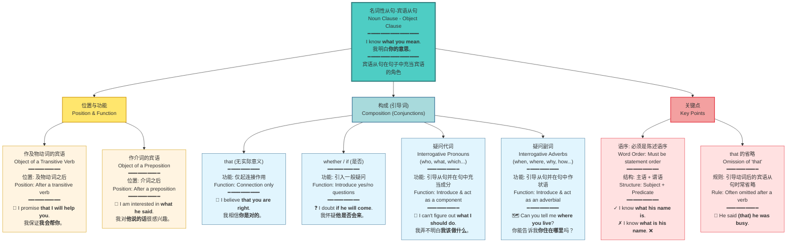

## 名词性从句-主语从句

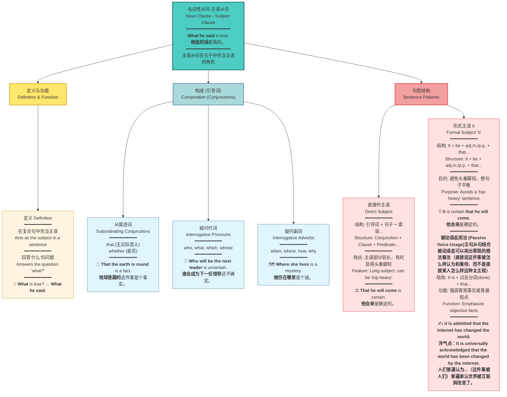

## 名词性从句-同位语从句

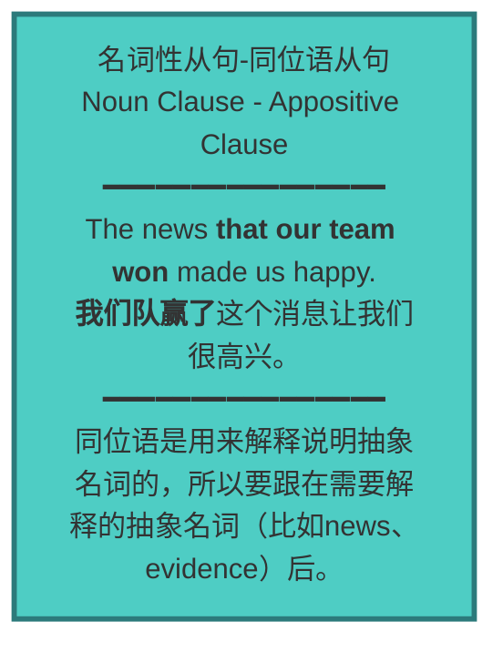

## 定语从句 (Attributive Clause)

```mermaid
graph TB
    A["定语从句完整知识体系<br/>Attributive Clause System<br/>━━━━━━━━━━━━━━━━<br/>一个句子做定语修饰限定名词<br/>A sentence functions as an adjective<br/>to modify and qualify a noun"] --> B["基本概念<br/>Basic Concepts<br/>━━━━━━━━━━━━━━━━"]
    
    A --> C["写法规则<br/>Writing Rules<br/>━━━━━━━━━━━━━━━━"]
    
    A --> D["分类<br/>Classification<br/>━━━━━━━━━━━━━━━━"]
    
    A --> E["特殊句型<br/>Special Patterns<br/>━━━━━━━━━━━━━━━━"]
    
    B --> B1["定义 Definition<br/>━━━━━━━━━━<br/>句子做定语修饰名词<br/>Sentence as adjective modifying noun<br/>━━━━━━━━━━<br/>🎯 确定名词范围<br/><br/>例句示例:<br/>I met the man **who lives next door**<br/>我认识了住在隔壁的男人"]
    
    B --> B2["位置 Position<br/>━━━━━━━━━━<br/>放在所修饰名词后<br/>Placed after the modified noun<br/>━━━━━━━━━━<br/>📍 就近修饰原则<br/><br/>例句示例:<br/>The book **which I bought yesterday** is interesting<br/>我昨天买的那本书很有趣"]
    
    B --> B3["关系词 Relative Word<br/>━━━━━━━━━━<br/>引出从句+做成分<br/>Introduces clause + makes component<br/>━━━━━━━━━━<br/>🔗 连接主从句<br/><br/>例句示例:<br/>This is the student **whose bike was stolen**<br/>这就是那个自行车被偷的学生"]
    
    B --> B4["先行词 Antecedent<br/>━━━━━━━━━━<br/>被修饰的名词<br/>The noun being modified<br/>━━━━━━━━━━<br/>🏷️ 关系词=先行词<br/><br/>例句示例:<br/>Australia is one of the few countries **where people drive on the left**<br/>澳大利亚是少数几个靠左行驶的国家之一"]
    
    C --> C1["写法步骤<br/>Writing Steps<br/>━━━━━━━━━━<br/>1. 先写陈述句<br/>Write declarative sentence first<br/>2. 前面加关系词<br/>Add relative word before<br/>3. 看先行词选择<br/>Choose based on antecedent<br/>━━━━━━━━━━<br/>📝 推倒小红旗法<br/><br/>例句演示:<br/>原句: I lost the book. I borrowed it last week.<br/>合并: I lost the book **which/that I borrowed last week**"]
    
    C --> C2["关系词选择表<br/>Relative Word Selection<br/>━━━━━━━━━━<br/>指事物: which/that<br/>指人: who/that/whom<br/>表所属: whose<br/>表时间: when<br/>表地点: where<br/>表原因: why<br/>━━━━━━━━━━<br/>🔍 看先行词，有逗号不能用that和省略关系词，关系词做宾语成分指人时只能用whom<br/><br/>例句对比:<br/>The man **who/that** called you is my boss<br/>The company **which/that** he works for is famous"]
    
    C --> C3["省略规则<br/>Omission Rules<br/>━━━━━━━━━━<br/>关系词做宾语可省略<br/>Relative word as object can be omitted<br/>━━━━━━━━━━<br/>✂️ 建议不省略<br/><br/>例句对比:<br/>完整: The book **which** I bought is good<br/>省略: The book I bought is good<br/>The man **whom** I met is friendly<br/>The man I met is friendly"]
    
    D --> D1["限定性<br/>Restrictive<br/>━━━━━━━━━━<br/>名词范围不明确<br/>Noun scope unclear<br/>━━━━━━━━━━<br/>无逗号/不可省略<br/>No comma / cannot omit<br/>━━━━━━━━━━<br/>往前翻译<br/>Translate forward<br/>━━━━━━━━━━<br/>🎯 必要限定<br/><br/>例句示例:<br/>I met your friend **who is staying in Paris**<br/>我遇见了你那位正在巴黎的朋友<br/>(朋友很多，需要限定是哪一位)"]
    
    D --> D2["非限定性，可省略<br/>Non-restrictive<br/>━━━━━━━━━━<br/>名词范围明确<br/>Noun scope clear<br/>━━━━━━━━━━<br/>有逗号时指人指物都不能用that且不可省略关系词<br/>Has comma / can omit<br/>━━━━━━━━━━<br/>补充说明<br/>Additional explanation<br/>━━━━━━━━━━<br/>💬 额外信息<br/><br/>例句示例:<br/>I met your mother, **who is very kind**<br/>我遇见了你妈妈，她很和蔼<br/>(妈妈只有一个，补充说明)"]
    
    E --> E1["介词提前<br/>Preposition Fronting<br/>━━━━━━━━━━<br/>in which, by whom等<br/>in which, by whom etc.<br/>━━━━━━━━━━<br/>介词提前只能用which/whom，不能用that,不能省略<br/>Cannot use that / cannot omit<br/>━━━━━━━━━━<br/>🔄 介宾团聚<br/><br/>例句对比:<br/>普通: The environment **which** we live in is polluted<br/>介词提前: The environment **in which** we live is polluted<br/>我们生活的环境被污染了"]
    
    E --> E2["特殊which<br/>Special which<br/>━━━━━━━━━━<br/>逗号+which修饰整句<br/>Comma + which modifies whole sentence<br/>━━━━━━━━━━<br/>📌 指代前面整件事<br/><br/>例句示例:<br/>Bilingual people enjoy better memories, **which can lead to health benefits**<br/>说双语的人记忆力更好，这能带来健康益处<br/>(which指代前面整句话的内容)"]
    
    style A fill:#4ECDC4,stroke:#2C7A7B,stroke-width:3px
    style B fill:#FFE66D,stroke:#D4A017,stroke-width:2px
    style C fill:#A8DADC,stroke:#457B9D,stroke-width:2px
    style D fill:#B8E0D2,stroke:#52B788,stroke-width:2px
    style E fill:#FFB6C1,stroke:#E63946,stroke-width:2px
    style B1 fill:#FFF4E1,stroke:#D4A017,stroke-width:1px
    style B2 fill:#FFE1E1,stroke:#E63946,stroke-width:1px
    style B3 fill:#E1F5FE,stroke:#457B9D,stroke-width:1px
    style B4 fill:#E8F5E9,stroke:#52B788,stroke-width:1px
    style C1 fill:#FFF4E1,stroke:#D4A017,stroke-width:1px
    style C2 fill:#FFE1E1,stroke:#E63946,stroke-width:1px
    style C3 fill:#E1F5FE,stroke:#457B9D,stroke-width:1px
    style D1 fill:#FFE1E1,stroke:#E63946,stroke-width:1px
    style D2 fill:#E8F5E9,stroke:#52B788,stroke-width:1px
    style E1 fill:#FFF4E1,stroke:#D4A017,stroke-width:1px
    style E2 fill:#E1F5FE,stroke:#457B9D,stroke-width:1px
```

## 状语从句 (Adverbial Clauses)

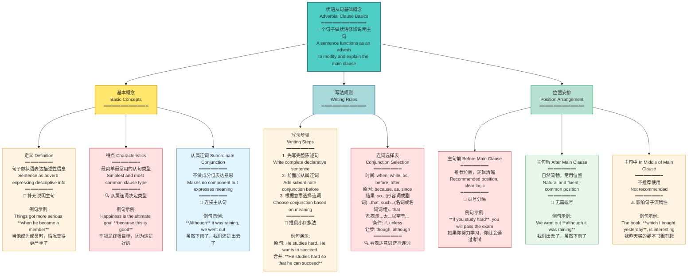

```mermaid
graph TB
    A["状语从句九种分类<br/>Nine Types of Adverbial Clauses<br/>━━━━━━━━━━━━━━━━<br/>从属连词表达什么意思<br/>就叫做什么状语从句<br/>The meaning expressed by the conjunction<br/>determines the type of clause"] --> B["雅思重点五种<br/>Five IELTS Focus Types<br/>━━━━━━━━━━━━━━━━"]
    
    A --> C["其他四种<br/>Four Other Types<br/>━━━━━━━━━━━━━━━━"]
    
    B --> B1["时间状语从句 Time Clause<br/>━━━━━━━━━━<br/>when, while, as, before, after<br/>since, until, as soon as<br/>━━━━━━━━━━<br/>🕒 表示时间关系<br/><br/>例句示例:<br/>**When** he arrived, we started the meeting<br/>当他到达时，我们开始了会议"]
    
    B --> B2["原因状语从句 Reason Clause<br/>━━━━━━━━━━<br/>because, as, since, now that<br/>━━━━━━━━━━<br/>🤔 表示因果关系<br/><br/>例句示例:<br/>**Because** it was raining, we stayed home<br/>因为下雨，我们待在家里"]
    
    B --> B3["结果状语从句 Result Clause<br/>━━━━━━━━━━<br/>so...that, such...that<br/>━━━━━━━━━━<br/>📊 表示结果关系<br/><br/>例句示例:<br/>He was **so** excited **that** he couldn't sleep<br/>他太兴奋了以至于睡不着<br/>**The boy kicked the ball so hard(作副词，用力地) that it nearly fell into the river.**<br/>男孩踢球太用力了，以至于球差点掉进河里<br/>**Homelessness has reached such proportions(作名词，比例) that local governments can't possibly cope.**<br/>无家可归问题已经达到了如此严重的程度，以至于地方政府根本无法应对"]
    
    B --> B4["条件状语从句 Condition Clause<br/>━━━━━━━━━━<br/>if<br/> unless(相当于if not，除非...),<br/> as long as(只要...)<br/>once(一旦...)<br/>on condition that<br/>━━━━━━━━━━<br/>🎯 表示条件关系<br/><br/>例句示例:<br/>**Unless** you study hard, you will fail<br/>除非你努力学习，否则你会失败"]
    
    B --> B5["让步状语从句 Concession Clause<br/>━━━━━━━━━━<br/>though, although, even if,even though 尽管(即使)...但是...(明让步，暗转折)<br/>while<br/>━━━━━━━━━━<br/>💪 表示转折让步<br/><br/>例句示例:<br/>**Although** it was expensive, I bought it<br/>虽然很贵，我还是买了"]
    
    C --> C1["目的状语从句 Purpose Clause<br/>━━━━━━━━━━<br/>so that, in order that<br/>━━━━━━━━━━<br/>🎯 因为表示目的是为了什么，什么就说明这事儿还没有成真，还没做吧？所以他后面会加上一个情态动词来表示可能性，这事还没有完全成真。所以请大家记住目的状语从句，这俩后面都会加情态动词。 <br/><br/>例句示例:<br/>He speaks loudly **so that** everyone can hear<br/>他大声说话以便每个人都能听到"]
    
    C --> C2["地点状语从句 Place Clause<br/>━━━━━━━━━━<br/>where, wherever<br/>━━━━━━━━━━<br/>📍 表示地点关系<br/><br/>例句示例:<br/>**Where** there is a will, there is a way<br/>有志者事竟成"]
    
    C --> C3["比较状语从句 Comparison Clause<br/>━━━━━━━━━━<br/>than, as...as<br/>━━━━━━━━━━<br/>⚖️ 表示比较关系<br/><br/>例句示例:<br/>Batteries can die faster **than we realized**<br/>电池耗尽比我们意识到的要快"]
    
    C --> C4["方式状语从句 Manner Clause<br/>━━━━━━━━━━<br/>as, the way<br/>━━━━━━━━━━<br/>🔄 表示方式方法<br/><br/>例句示例:<br/>**When in Rome, do as Romans do**<br/>入乡随俗"]
    
    style A fill:#4ECDC4,stroke:#2C7A7B,stroke-width:3px
    style B fill:#FFB6C1,stroke:#E63946,stroke-width:2px
    style C fill:#B8E0D2,stroke:#52B788,stroke-width:2px
    style B1 fill:#FFE1E1,stroke:#E63946,stroke-width:1px
    style B2 fill:#FFE1E1,stroke:#E63946,stroke-width:1px
    style B3 fill:#FFE1E1,stroke:#E63946,stroke-width:1px
    style B4 fill:#FFE1E1,stroke:#E63946,stroke-width:1px
    style B5 fill:#FFE1E1,stroke:#E63946,stroke-width:1px
    style C1 fill:#FFF4E1,stroke:#D4A017,stroke-width:1px
    style C2 fill:#FFF4E1,stroke:#D4A017,stroke-width:1px
    style C3 fill:#E1F5FE,stroke:#457B9D,stroke-width:1px
    style C4 fill:#E1F5FE,stroke:#457B9D,stroke-width:1px
```


